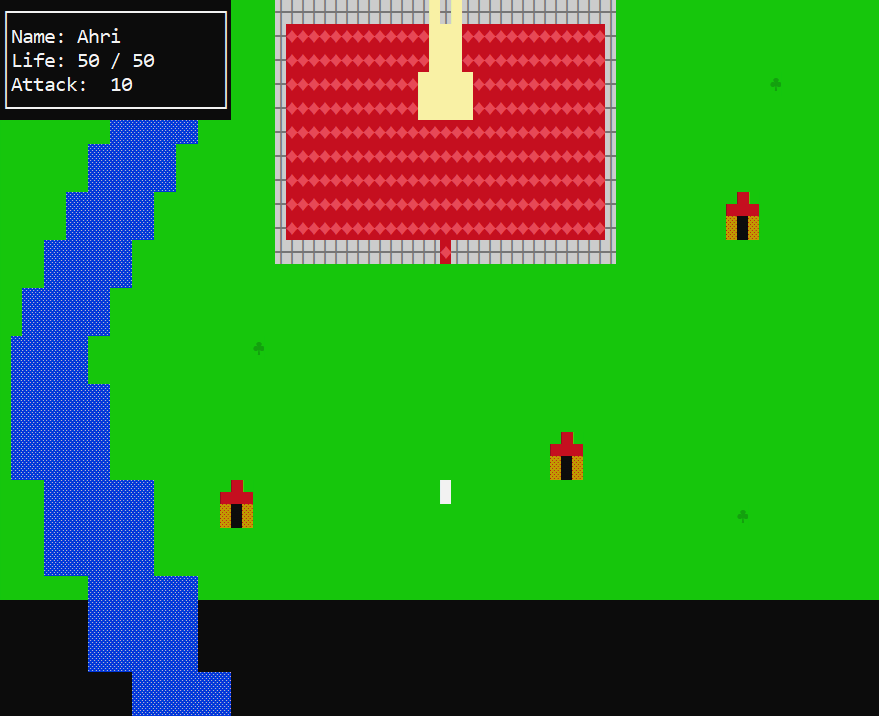
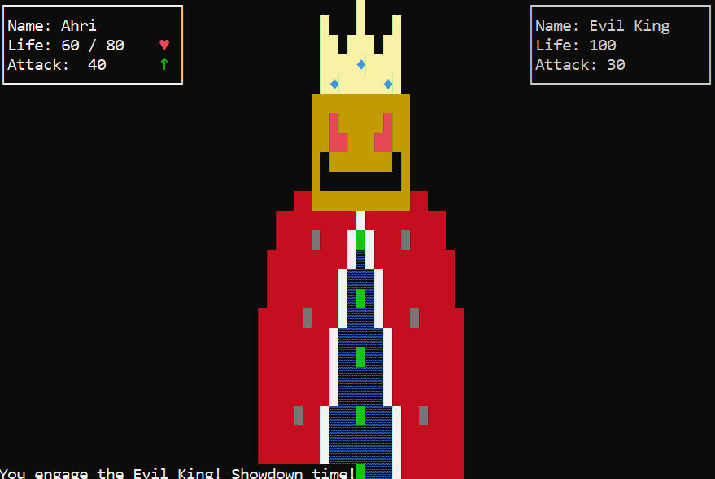

# Jogo de RPG em C

Projeto acadêmico desenvolvido individualmente no 1º semestre de 2023 durante a graduação em Engenharia de Computação na UTFPR.

### Sobre o projeto

Jogo de RPG inspirado em jogos clássicos de Atari e NES, desenvolvido em linguagem C com interface de terminal utilizando a biblioteca PDCurses.

O projeto foi desenvolvido individualmente, com foco na organização modular do sistema, implementação da lógica do jogo, interação com o jogador e apresentação gráfica.

### Tecnologias

- C
- PDCurses 3.9
- SDL2 2.0.22

### Principais características

- Sistema de RPG jogável
- Interface em terminal
- Organização modular dos componentes
- Sistema de renderização e atualização da tela
- Sistema de combate
- Sistema de áudio
- Gerenciamento de estados e elementos do jogo

### Demonstração






### Dependências

Para compilar o projeto, são necessárias:

- GCC / MinGW-w64
- PDCurses 3.9
- SDL2 2.0.22

As versões específicas de PDCurses e SDL2 são utilizadas para preservar a compatibilidade visual e sonora com a versão original do projeto.

### Compilação

O projeto foi originalmente desenvolvido no Windows utilizando Code::Blocks. Atualmente, o código pode ser compilado utilizando GCC / MinGW-w64.

Com as dependências configuradas, execute:

```bash
gcc main.c game.c graphics.c sound.c \
    -I/caminho/para/PDCurses-3.9 \
    -I/caminho/para/SDL2-2.0.22/include/SDL2 \
    -L/caminho/para/PDCurses-3.9/wincon \
    -L/caminho/para/SDL2-2.0.22/lib \
    -fcommon \
    -l:pdcurses.a \
    -lmingw32 \
    -l:libSDL2main.a \
    -l:libSDL2.dll.a \
    -lm \
    -o bin/jogo-rpg.exe
```

Os caminhos devem ser ajustados de acordo com a localização das dependências no computador.

### Execução

Após a compilação, execute bin/jogo-rpg.exe.

O arquivo Bestiary.txt deve permanecer no mesmo diretório do executável.

### Versão pronta para execução

Uma versão pré-compilada para Windows x64 está disponível em [Releases](../../releases).
